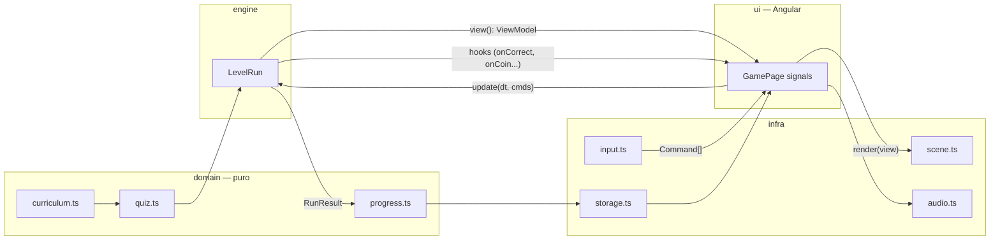
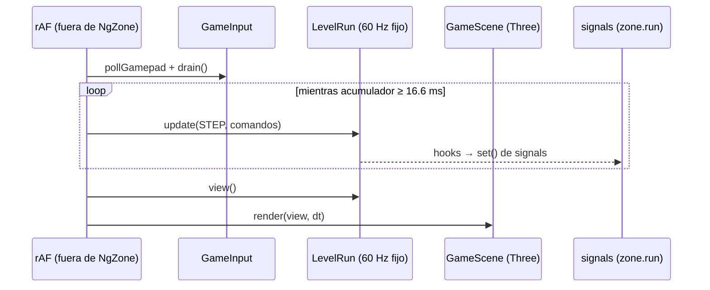
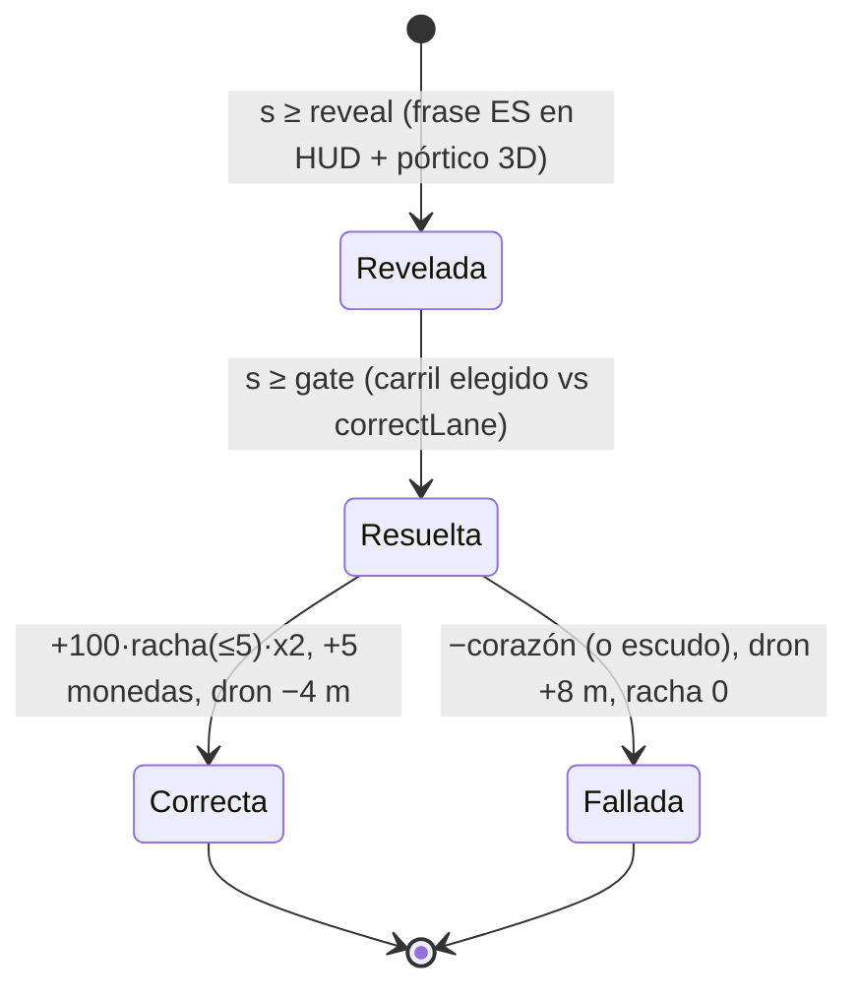

# Arquitectura — English Rail Runner (Ionic + Angular)

## Visión general
Endless runner 3D educativo (ES→EN) construido como app **Ionic + Angular 20 standalone**
con **Three.js** para el render y **Capacitor** para el empaquetado nativo iOS/Android.
El juego sigue **clean architecture**: el dominio no conoce Angular ni Three.js; el engine
es simulación pura a paso fijo; la infraestructura (render, input, audio, storage) es
intercambiable; la UI es un componente Angular con signals.

## Tecnologías
| Capa | Tecnología |
|---|---|
| Framework app | Angular 20 (standalone, signals, control flow `@if/@for`) + Ionic 8 |
| Render 3D | Three.js 0.170 (npm) + GLTFLoader |
| Modelos 3D | GLB generados con IA (héroe zorro, vagón) + props procedurales |
| Audio | WebAudio API (música + 5 SFX generados) |
| Persistencia | localStorage (sin autenticación, por diseño) |
| Nativo | Capacitor 8 (`capacitor.config.ts`, webDir `www`) |
| Build | Angular CLI (esbuild) → `www/` |

## Estructura de carpetas
```
english-rail-runner/            # proyecto Ionic (raíz del repo git)
├── src/
│   ├── app/
│   │   ├── app.routes.ts       # ruta única '' → GamePage (lazy)
│   │   ├── app.component.*     # shell ion-app + ion-router-outlet
│   │   └── game/
│   │       ├── strings.ts      # TODOS los textos visibles (ES)
│   │       ├── domain/         # puro: sin Angular, sin Three, sin DOM
│   │       │   ├── curriculum.ts   # 36 niveles + levelConfig(i) + WordPair
│   │       │   ├── quiz.ts         # RNG con semilla, preguntas + distractores
│   │       │   ├── progress.ts     # estrellas, desbloqueo, aprendidas, falladas, logros
│   │       │   ├── review.ts       # nivel sintético con las palabras falladas
│   │       │   └── achievements.ts # catálogo de logros + evaluación pura
│   │       ├── engine/
│   │       │   └── level-run.ts    # LevelRun: simulación a paso fijo, colisiones,
│   │       │                       # puertas de respuesta, potenciadores, dron
│   │       ├── infra/
│   │       │   ├── scene.ts        # escena Three.js (pools, tren, héroe, carteles)
│   │       │   ├── input.ts        # teclado (event.code) + swipes + gamepad
│   │       │   ├── audio.ts        # WebAudio, desbloqueo en primer gesto
│   │       │   └── storage.ts      # load/save de Progress
│   │       └── game.page.{ts,html,scss}  # UI: HUD + menús con signals
│   ├── assets/game/{models,tex,audio}/   # GLB, texturas, clips
│   ├── index.html  global.scss  theme/
├── design/                     # plan de diseño, STYLE FORMULA, manifiesto de assets
├── tools/                      # scripts pipeline (seamless de texturas, inspector GLB)
├── tasks/  docs/  .ai/         # gestión y documentación
├── capacitor.config.ts         # appId com.dmarmijosa.englishrailrunner
└── angular.json  package.json
```

## Flujo de datos


## Bucle principal

- El bucle corre **fuera de NgZone** (`zone.runOutsideAngular`) para no disparar change
  detection 60 veces/s; los eventos de juego entran con `zone.run()` y actualizan signals.
- Simulación determinista: paso fijo de 16.6 ms + RNG con semilla por nivel
  (`mulberry32(level.id * 7919 + 13)`).

## Ciclo de una pregunta


## Comunicación entre módulos
- `GamePage` es el único punto de cableado: crea `LevelRun` con `RunHooks` (callbacks
  tipados) y traduce eventos a signals + audio. Dominio y engine jamás importan Angular.
- `GameScene.render(view)` consume un **ViewModel plano** — no lee el estado interno del run.
- `strings.ts` centraliza todo texto visible: cambiar idioma = cambiar datos.

## Presupuestos de rendimiento (medidos con `?dev=1`)
- 120 fps en desktop, ~70–97 draw calls, ~460k triángulos.
- DPR cap 1.5; sin shadow maps (blob shadow); niebla limita el draw a 130 u.
- Monedas y traviesas como InstancedMesh; pools para todo (cero allocs en el frame loop).
